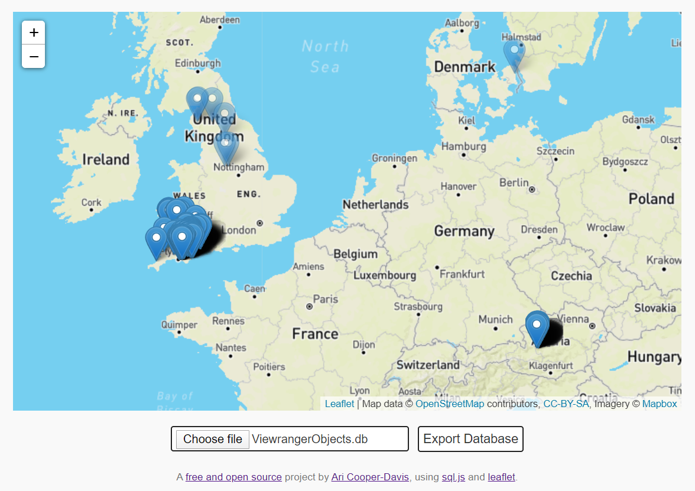

# ViewRanger POI Editor
*Bulk edit the POIs in your ViewRanger Database*

ViewRanger POI Editor is a site, written in JavaScript, that enables you to visualise and bulk edit the POIs in your ViewRanger Database.

## Background
[ViewRanger](https://www.viewranger.com/en-gb) is a mapping service that allows you to navigate, plot routes, and add Points of Interest (POIs) to maps on your mobile device. However, it is notoriously difficult to bulk edit your POIs, and the interface for editing them requires you to click one by one on the POIs to delete them. There must be a better way?

## Get Started
### Using the Site
The site is pretty self explanatory; Simply upload your ViewRanger Objects Database and click POIs to toggle them off. Shift-click and drag to toggle multiple POIs in a bounding box.

When you're done click `Export` and you can download your new Database file. I recommend making a backup of your original `ViewrangerObjects.db` rather than overwriting it, just in case.

#### The Viewranger Objects Database
##### Android
In ViewRanger navigate to your `Settings`, and scroll down to `Storage`. Your `Default Folder` path should be displayed. The file that you need to upload to the site is in this folder, and is called `ViewrangerObjects.db`.

##### iOS
I don't have an iOS device so don't know where the ViewRanger Databse file is stored, or whether it's even accessible to non-rooted users. If you know, then please feel free to update this README.

### Online Demo Site
Feel free to use the [fully functional demo-site](https://aricooperdavis.github.io/ViewRanger-POI-Editor/) built from this repository and running on GitHub pages. Note, however, that I have a free mapbox account, so am [limited to 200,000 static tiles per month](https://www.mapbox.com/pricing/#gltile). This is generous, and I don't expect to exceed it, but if your map isn't loading properly then you may need to use your own mapbox api key.

### Host Locally
Clone the repository, navigate into the main folder, and start an http server. Any server will do, but my favourite is:

`python -m http.server`

Then, in your browser navigate to:

`localhost:8000`

And you will be able to use the site.

## Contributing
Please do - by filing any [issues](https://github.com/aricooperdavis/ViewRanger-POI-Editor/issues) you encounter or any [enhancements](https://github.com/aricooperdavis/ViewRanger-POI-Editor/labels/enhancement) you can think of, or even better by coding up those improvements yourself and making a [pull request](https://github.com/aricooperdavis/ViewRanger-POI-Editor/pulls).
